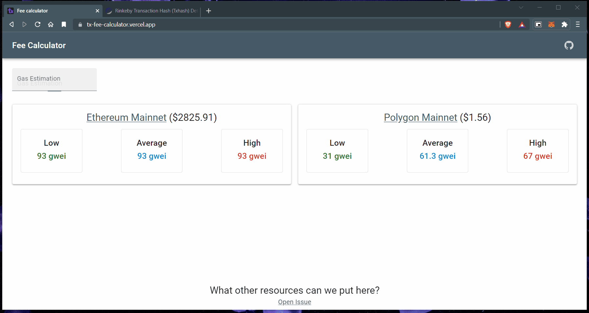

# Fee Calculator

Estimate the transaction fee price with the estimated/used gas.

Issues, PRs are more than welcome.



## Development

To run your Remix app locally, make sure your project's local dependencies are installed:

```sh
npm install
```

Afterwards, start the Remix development server like so:

```sh
npm run dev
```

Open up [http://localhost:3000](http://localhost:3000) and you should be ready to go!

---

**Enjoy!**
